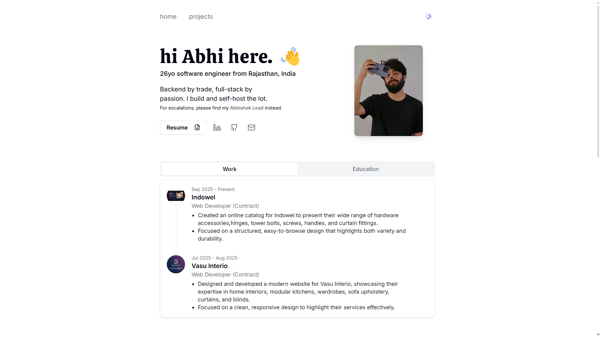

# My Personal Portfolio

A clean, minimal portfolio website built with Next.js, Tailwind CSS, and Shadcn UI. Features an AI chatbot, email contact form, and blog.

> The main branch is where I experiment with new ideas. If you want a stable, ready-to-use version, check out the [v1.0.0 release](https://github.com/Abhiiyaar/abhiiyaar-portfolio).

## Live Demo

🌐 Check it out here: **[abhiiyaar.netlify.app](https://abhiiyaar.netlify.app)**



## Features

- Minimal design with Shadcn UI
- Light/dark mode toggle
- Responsive mobile design

## Tech Stack

### v1.0.0

- Next.js
- Tailwind CSS
- Shadcn UI
- Netlify (hosting)

### Main branch

- Next.js
- Tailwind CSS
- Shadcn UI
- Netlify (hosting)

## Getting Started

```bash
git clone https://github.com/Abhiiyaar/abhiiyaar-portfolio my-portfolio
cd my-portfolio
git checkout tags/v1.0.0
npm install
npm run dev
```

## Customization

- Update personal info in `src/data/*.json`
- Replace projects in `src/data/projects.json`
- Replace your resume with `public/resume.pdf`

## Deployment

I prefer [Netlify](https://app.netlify.com/) for Next.js projects:

1. Push your fork to GitHub
2. Connect repo to Vercel
3. Add environment variables
4. Deploy 🎉


## License

MIT


✨ Feel free to fork and make it your own! Would love to see what you guys do with it!

-- Abhishek
